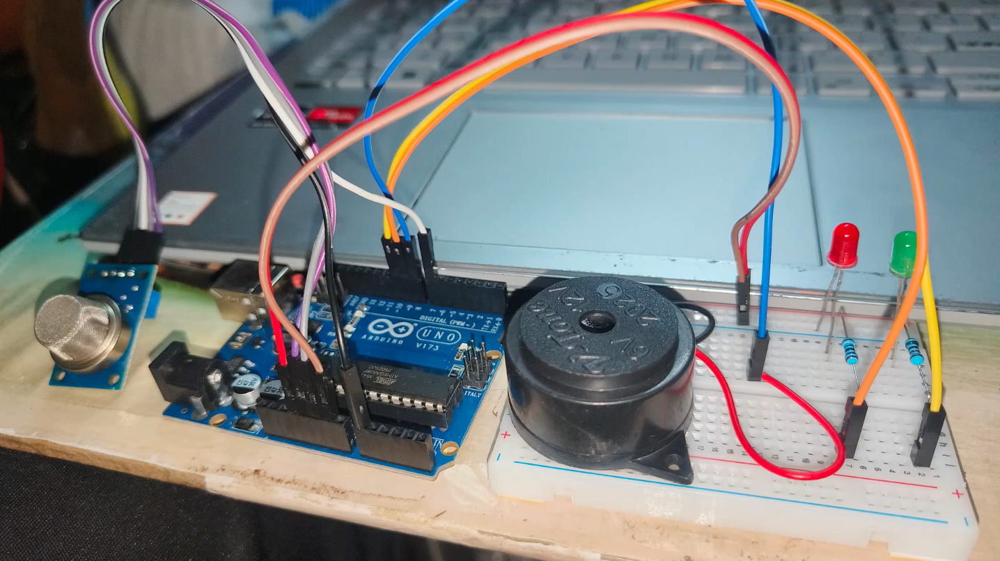
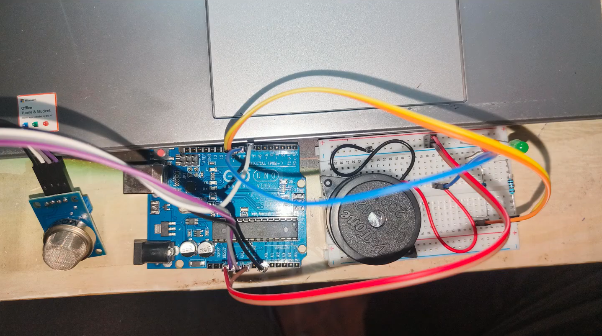
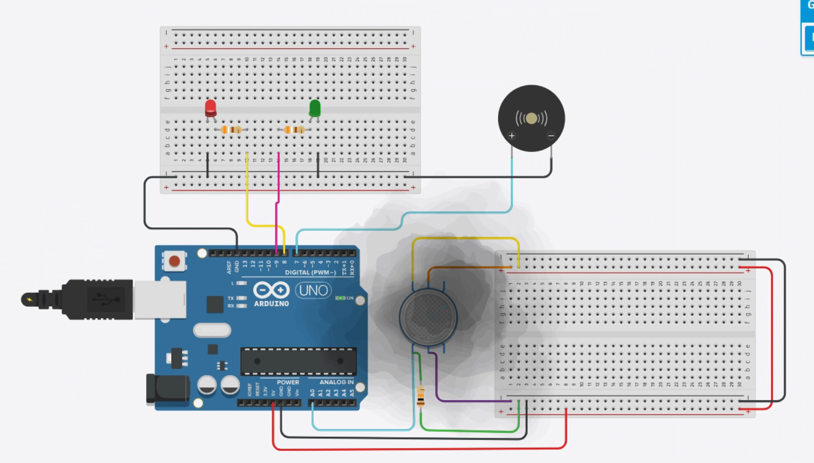

# Smoke and Gas Detection Alarm using Arduino 🚨

> An Arduino-based smoke and gas detection system using an **MQ-2 gas sensor**, **Red and Green LEDs**, and a **buzzer** to provide visual and audible alerts when the detected sensor value exceeds a predefined threshold.

---

## 📖 Overview

The **Smoke and Gas Detection Alarm using Arduino** is a simple embedded safety system designed to detect the presence of **smoke and combustible gases** using an **MQ-2 gas sensor**.

The Arduino continuously reads the analog output of the MQ-2 sensor and compares the sensor value with a predefined threshold.

* 🟢 **Normal condition:** Green LED remains ON and the buzzer is OFF.
* 🔴 **Smoke/Gas detected:** Red LED turns ON and the buzzer is activated.

The project also displays the real-time MQ-2 sensor readings through the **Arduino Serial Monitor**, allowing the sensor response to be observed during testing.

---

## 🎥 Project Demonstration

The project can be tested using the physical Arduino circuit as well as the **Tinkercad simulation** included in this repository.

---

## 📸 Project Images

### 🔧 Hardware Setup



### 🛠️ Project Hardware



### 💻 Tinkercad Simulation



---

## ✨ Features

* 🚨 Real-time smoke and gas detection
* 🌫️ MQ-2 gas and smoke sensor
* 🟢 Green LED indication for normal conditions
* 🔴 Red LED indication for detected smoke/gas
* 🔊 Audible alarm using a buzzer
* 📊 Real-time sensor readings through Serial Monitor
* ⚙️ Adjustable detection threshold
* 💻 Arduino-based embedded system
* 🧪 Tinkercad circuit simulation

---

## 🧰 Components Required

| Component       |    Quantity | Purpose                   |
| --------------- | ----------: | ------------------------- |
| Arduino UNO     |           1 | Main controller           |
| MQ-2 Gas Sensor |           1 | Smoke and gas detection   |
| Red LED         |           1 | Danger indication         |
| Green LED       |           1 | Safe condition indication |
| Buzzer          |           1 | Audible alarm             |
| 220Ω Resistor   |           2 | LED current limiting      |
| Breadboard      |           1 | Circuit prototyping       |
| Jumper Wires    | As required | Circuit connections       |
| USB Cable       |           1 | Programming and power     |

---

## 🔌 Circuit Connections

| Component                   | Arduino Pin |
| --------------------------- | ----------- |
| **MQ-2 Analog Output (AO)** | A0          |
| **Red LED**                 | D8          |
| **Green LED**               | D9          |
| **Buzzer**                  | D7          |
| **MQ-2 VCC**                | 5V          |
| **MQ-2 GND**                | GND         |

### Pin Configuration

```cpp
#define MQ2 A0
#define RED_LED 8
#define GREEN_LED 9
#define BUZZER 7
```

---

## ⚙️ Working Principle

The system operates in the following sequence:

1. The **MQ-2 sensor** detects smoke or combustible gas in the surrounding environment.
2. The sensor produces an analog output corresponding to the detected gas/smoke level.
3. Arduino reads this analog value through **A0**.
4. The sensor value is displayed on the **Serial Monitor**.
5. Arduino compares the sensor reading with the predefined threshold.
6. If the reading is below the threshold:

   * 🟢 Green LED turns ON.
   * 🔴 Red LED turns OFF.
   * 🔊 Buzzer remains OFF.
7. If the reading reaches or exceeds the threshold:

   * 🟢 Green LED turns OFF.
   * 🔴 Red LED turns ON.
   * 🔊 Buzzer turns ON.
8. The system continuously repeats this process to monitor the environment.

---

## 🚨 Detection Logic

The project uses a threshold value to determine whether smoke or gas has been detected.

```cpp
int smokeThreshold = 500;
```

### Normal Condition

```text
Sensor Value < 500
        │
        ├── Green LED → ON
        ├── Red LED   → OFF
        └── Buzzer    → OFF
```

### Smoke/Gas Detected

```text
Sensor Value >= 500
        │
        ├── Green LED → OFF
        ├── Red LED   → ON
        └── Buzzer    → ON
```

> **Note:** The threshold value of `500` is an example used by this project. The actual sensor response depends on the MQ-2 module, environment, warm-up time, and testing conditions. Adjust the threshold according to your setup.

---

## 📊 Serial Monitor

The Arduino continuously prints the MQ-2 sensor value to the Serial Monitor.

Set the Serial Monitor baud rate to:

```text
9600 baud
```

This allows you to observe how the sensor value changes when smoke or gas is introduced.

Example:

```text
MQ-2 Sensor Value: 287
MQ-2 Sensor Value: 314
MQ-2 Sensor Value: 521
Smoke/Gas Detected!
```

---

## 🧪 Tinkercad Simulation

A simulated version of the project is available in the **Tinkercad** folder.

### Simulation Files

```text
Tinkercad/
├── README.md
└── Smoke Detection Alarm.png
```

### Tinkercad Simulation Preview


The Tinkercad simulation demonstrates the basic circuit operation and allows the detection logic to be tested without the physical hardware.

---

## 💻 Software Used

### Arduino IDE

The Arduino IDE is used to:

* Write the Arduino program
* Compile the source code
* Upload the program to the Arduino UNO
* Monitor sensor readings through the Serial Monitor

### Tinkercad Circuits

Tinkercad is used to create and simulate the circuit virtually before or alongside physical implementation.

---

## 🚀 How to Run the Project

### Step 1 — Build the Circuit

Connect the Arduino, MQ-2 sensor, LEDs, resistors, and buzzer according to the circuit connection table.

### Step 2 — Open the Code

Open:

```text
Code/Smoke and Gas Detection Alarm using Arduino.ino
```

using the Arduino IDE.

### Step 3 — Select Arduino Board

In Arduino IDE:

```text
Tools → Board → Arduino UNO
```

Select the appropriate COM port under:

```text
Tools → Port
```

### Step 4 — Upload the Program

Upload the program to the Arduino UNO.

### Step 5 — Open Serial Monitor

Open:

```text
Tools → Serial Monitor
```

Set the baud rate to:

```text
9600
```

### Step 6 — Test the Sensor

Expose the MQ-2 sensor to a suitable test environment and observe the sensor readings.

When the reading reaches the configured threshold:

* 🔴 Red LED turns ON
* 🟢 Green LED turns OFF
* 🔊 Buzzer turns ON

---

## 📈 Expected Output

### 🟢 Normal Condition

| Output    | Status |
| --------- | ------ |
| Green LED | ON     |
| Red LED   | OFF    |
| Buzzer    | OFF    |
| Alarm     | No     |

### 🔴 Smoke/Gas Detected

| Output    | Status |
| --------- | ------ |
| Green LED | OFF    |
| Red LED   | ON     |
| Buzzer    | ON     |
| Alarm     | Active |

---

## 🖼️ Project Demonstration

The repository contains photographs of the hardware implementation and simulation.

### Hardware


### Simulation


---

## 🧠 About the MQ-2 Sensor

The **MQ-2** is a commonly used gas sensor module for detecting smoke and several combustible gases.

It can respond to gases such as:

* Smoke
* LPG
* Propane
* Methane
* Hydrogen
* Other combustible gas vapors

The MQ-2 module typically provides:

* **AO — Analog Output**
* **DO — Digital Output**
* **VCC — Power**
* **GND — Ground**

This project uses the **Analog Output (AO)** to obtain a variable sensor reading and perform threshold-based detection in the Arduino program.

> **Important:** This project is intended as an educational/prototype detection system. It should not be treated as a certified gas-leak or fire-safety device. Accurate gas concentration measurements require proper sensor calibration and an appropriate measurement methodology.

---

## 🎯 Applications

The project can be used as a basic platform for:

* 🏠 Home safety monitoring
* 🍳 Kitchen gas monitoring
* 🔥 Smoke detection prototypes
* 🏭 Industrial environment monitoring
* 🧪 Laboratory safety demonstrations
* 🤖 Robotics safety systems
* 🎓 Embedded systems education
* 🌐 Future IoT-based monitoring systems

---

## 🔮 Future Improvements

The project can be extended with:

* 📟 16×2 LCD or OLED display
* 📶 ESP32/ESP8266 wireless connectivity
* 📱 Mobile notifications
* 📧 Email alerts
* 📩 SMS notifications
* ☁️ IoT cloud monitoring
* 📊 Real-time sensor data logging
* 🔋 Battery-powered operation
* 🌡️ Temperature and humidity monitoring
* 🔔 Adjustable alarm levels
* 📈 Web-based monitoring dashboard

---

## 📁 Repository Structure

```text
MQ2-Smoke-Gas-Detection-Alarm/
│
├── Code/
│   └── Smoke and Gas Detection Alarm using Arduino.ino
│
├── Hardware-&-Image's/
│   ├── Hardware-IMG1.png
│   ├── Hardware-IMG2.png
│   ├── TinkerCAD-Simulation.png
│   └── addsffva
│
├── Tinkercad/
│   ├── README.md
│   └── Smoke Detection Alarm.png
│
└── README.md
```

> `addsffva` appears to be an unused/temporary file. For a clean professional repository, I recommend deleting it.

---

## 🛠️ Technologies Used

* **Arduino UNO**
* **MQ-2 Gas Sensor**
* **Arduino IDE**
* **Tinkercad Circuits**
* **Embedded C / Arduino C++**
* **Digital Electronics**
* **Analog Sensor Interfacing**

---

## 👨‍💻 Author

**Imandi Lakshmi Pavan Kalyan Imandi**

Electronics & Communication Engineering

GitHub: **[Pavan Kalyan Imandi](https://github.com/PavankalyanECE/)**

LinkedIn: **[Lakshmi Pavan Kalyan Imandi](https://www.linkedin.com/in/pavan-kalyan-imandi/)**

---

## ⭐ Support

If you found this project useful, consider giving the repository a **⭐ Star** on GitHub.

Feel free to explore the **Arduino source code, hardware implementation, and Tinkercad simulation** included in this repository.
